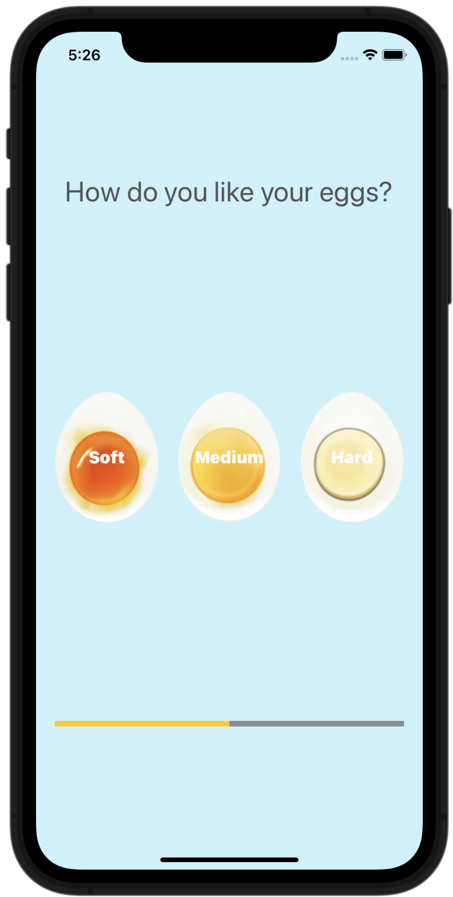

# Egg-Timer

This is a beautiful egg timer app to boil your eggs to perfection depending on how you prefer your eggs.

While making this app we learned:

Swift Collection types - Dictionaries
The Swift Timer API
Conditional statements - IF/ELSE
Conditional statements - Switch
Functions with outputs
How to use the ProgressView
This is a companion project to The App Brewery's Complete App Development Bootcamp, check out the full course at www.appbrewery.co
